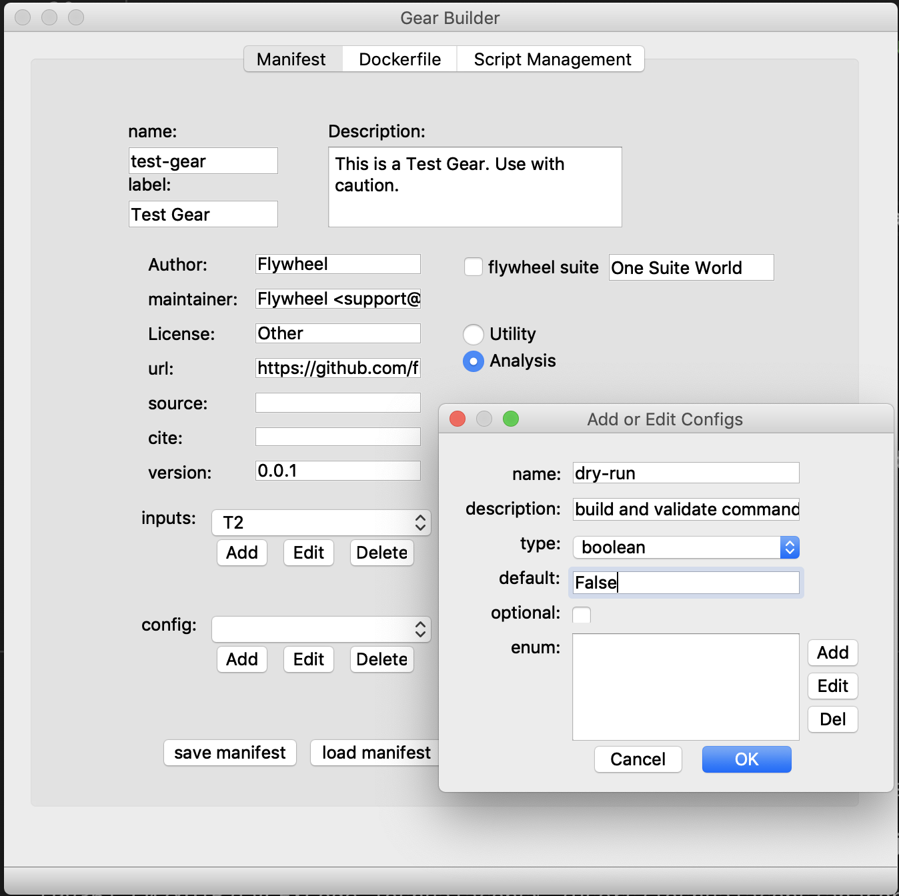

# fw-gear-building-gui

This is a graphical user interface (GUI) for building the essential components for [flywheel "gears"](https://flywheel.io/gear-exchange/) ([*](#disclosure)) (dockerized algorithms for processing life-science data). 

Written in PyQt, this cross-platform graphical user interface eases the pain and complexity of the gear-building experience.  It delivers a completely functional set of essential gear components for the user to customize.  This functional prototype delivers the following:

* A complete manifest.json file
* A draft of the gear's README.md file
    - With details filled in from the manifest.
* A minimal, yet fully functional, Dockerfile
    - With appropriately asigned apt and pip packages
    - Assigning environment variables
* A minimal, yet fully functional, script/package/module structure
    - Manually customize for specific application

See notes below for current and proposed functionality.

This project is build in PyQt6, a platform-independent gui framework. Build on any operating system, deploy on every operating system. The PyQt6 framework is available through both both conda and pip installers.

## Current Functionality

### Manifest

The manifest portion of the gear-building-gui is the most developed.
It currently:

* provides edit functionality for gear name, label, description, author, maintainer, source, url, cite, and version.
* automatically populates the "custom" section with the docker file names.
* provides add, edit, delete functionality of input elements.
* provides add, edit, delete functionality of config elements.
* validates entries with respects to the gear specification.
* loads existing `manifest.json` file to populate form.
* saves to a `manifest.json` file.
* saves a draft of a `README.md` file that is populated with values from the manifest.

### Dockerfile

A fully functional Dockerfile is provided as a template to work from.  Knowledge of docker commands is assumed.

* Provides interface to specify apt-get packages to install in Dockerfile.
* Provides interface to specify pip packages to install in Dockerfile.
* Provides interface to specify multiple environment values in Dockerfile.
* Cross-references 'maintainer' value with Manifest section to ensure consistency.

### Gear Templates

A fully functional "Hello World" Python gear script and utils package is provided as a template to work from. Familiarity with flywheel Python SDK is assumed.

This has an "Import Gear Template" button that allows referencing custom templates outside of the default gear templates listed. These custom templates are assumed to have:

- A top-level directory structure representing a template rendered with the default settings.
- A `.template` directory with the following:
    - `gear_template_directives.json`: a file containing the template name and files to be rendered or copied.
        - this file is copied to `~/.gearbuilder/gear_library/<template_name>/` with the addition of the location `.template` directory. The contents are updated from `.template` whenever it is loaded. This ensures changes to the original template (say from a repository) are maintained in the working copy.
    - the various files to be rendered or copied.
    - an optional `.template.gear.json` file with the default values for manifest and docker settings.
- For a completely functional template see the [skeleton](https://gitlab.com/joshicola/skeleton/-/tree/templating) gear template.

## Disclosure
This is a project that has been established and published by me, Joshua Jacobs, independent of Flywheel and its associates. This code is a contribution to the open source community on an "as-is" basis. Any questions about preferred "gear building" strategies should be directed at the representatives of Flywheel.

I have thoroughly enjoyed the process of architecting, designing, and building this project over time. Collaborations are welcomed.